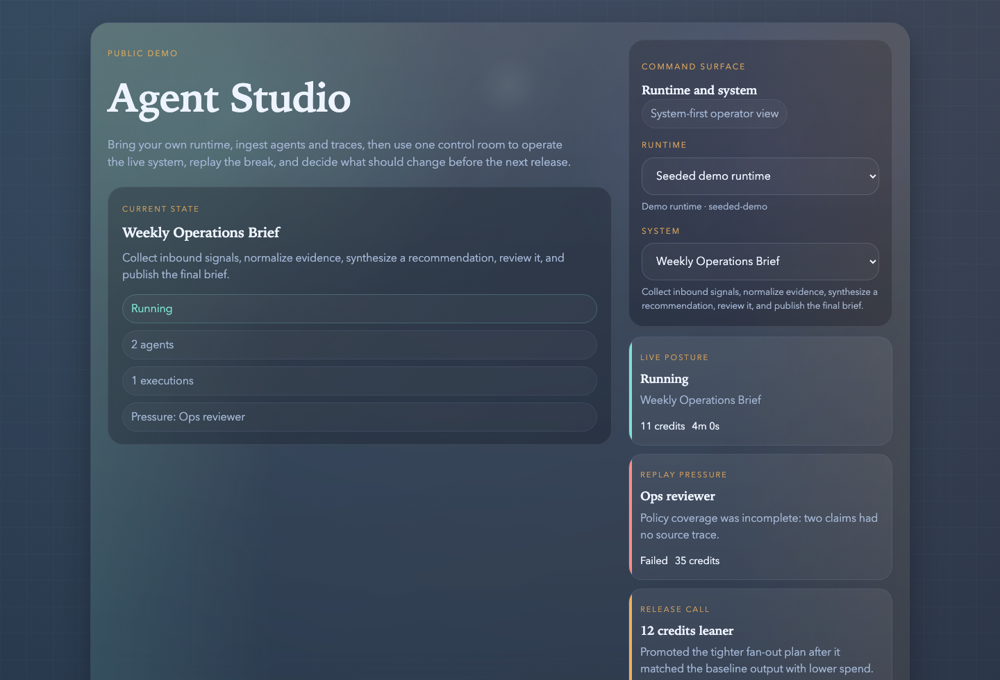

# Agent Studio

The open control room for multi-agent systems.

Agent Studio is for teams running real agents and multi-agent systems who need to answer four practical questions:

- What is running right now?
- Which agents or systems are under pressure?
- What exactly failed?
- What should change before the next release?

## Why this exists

Most agent tooling is strong at one piece of the loop:

- framework
- tracing
- evals
- memory
- prompt iteration

Agent Studio is aimed at the operating loop across all of that:

- register the real system
- inspect fleet pressure
- replay the failing path
- compare interventions
- release with evidence

It is not another agent builder and it is not a generic RAG chat tool.

## Who this is for

Agent Studio is a good fit when:

- you run more than one agent and the system is already hard to reason about
- you need one control room across runtimes
- you have real replay, intervention, or release decisions to make

It is not the target for:

- single-prompt toys
- teams that only want raw tracing
- projects that do not have a real system or release loop yet

This repo currently gives you:

- a public control-room demo
- a runtime-agnostic control-plane contract
- a bring-your-own ingest path
- a shipped LangGraph adapter

## Live demo

- Public demo: https://agent-studio-sage.vercel.app

## Architecture

## What ships here

- `apps/web` for the public demo shell with `Live`, `Replay`, and `Optimize`
- `apps/api` for the local API and ingest surface
- `packages/contracts` for the shared runtime contract
- `packages/sdk-js` for JS instrumentation
- `packages/sdk-python` for the Python instrumentation path
- `packages/demo` for the seeded demo dataset
- `packages/adapters/langgraph` for the first shipped adapter
- `packages/adapters/openhands` is planned, not shipped yet

## Current product surface

The current public demo already shows the core shape:

- system-first overview instead of workflow-first storytelling
- cross-system fleet overview and watchlist
- searchable agent roster
- execution and release history
- time-windowed analytics
- persistent hosted control-plane state on the public demo

## Connection paths

Agent Studio is built to ingest external systems instead of forcing you into one framework.

- `LangGraph adapter`
  - shipped
  - best when you already run LangGraph and want to ingest real runs and replay context
- `Generic control-plane ingest`
  - shipped
  - best when your runtime can emit JSON, webhooks, or internal events
- `OpenHands adapter`
  - planned
  - not shipped yet

## Fastest connection path

The shortest safe path inside the product is:

1. Register the runtime and system
2. Import the agent roster and topology
3. Import executions, spans, and metrics
4. Import evaluations or release decisions

That progression matters:

- `Live` needs agents and topology
- `Replay` needs executions and spans
- `Optimize` needs evaluation or release evidence

## How the product evolves

Agent Studio should get stronger as the system runs longer:

1. Register the system and agent roster
2. Ingest topology and live execution traces
3. Compare failures and release candidates with evidence
4. Build historical operator memory across incidents and interventions
5. Add guarded recommendations and automation only after the evidence loop is healthy

The key idea is not “self-evolving AI magic.”

The key idea is:

> the longer your system runs, the more context Agent Studio has to explain pressure, compare fixes, and support better release decisions

## Read This First

- [Install](./docs/install.md)
- [Quickstart](./docs/quickstart.md)
- [Demo](./docs/demo.md)
- [Demo script](./docs/demo-script.md)
- [Architecture overview](./docs/architecture-overview.md)
- [Birdview audit](./docs/birdview-audit-2026-04-22.md)
- [Top trending plan](./docs/top-trending-plan-2026-04-22.md)
- [LangGraph adapter](./docs/adapters/langgraph.md)
- [OpenHands adapter](./docs/adapters/openhands.md)

## Public launch

This repo is the standalone open-source surface for Agent Studio. The public demo reads seeded data from the API, and the API defaults to `http://localhost:4000`.

## Persistence modes

Agent Studio now supports three storage modes:

- `memory`
  - default fallback
  - good for a seeded demo
  - not durable across cold starts
- `file`
  - self-hosted persistence
  - set `AGENT_STUDIO_STORE_FILE=/absolute/path/to/store.json`
- `blob`
  - hosted persistence for Vercel deployments
  - uses `BLOB_READ_WRITE_TOKEN`
  - optional `AGENT_STUDIO_BLOB_PATH` overrides the default snapshot path `control-plane/store.json`

If `BLOB_READ_WRITE_TOKEN` is present, Agent Studio automatically prefers hosted blob persistence.
