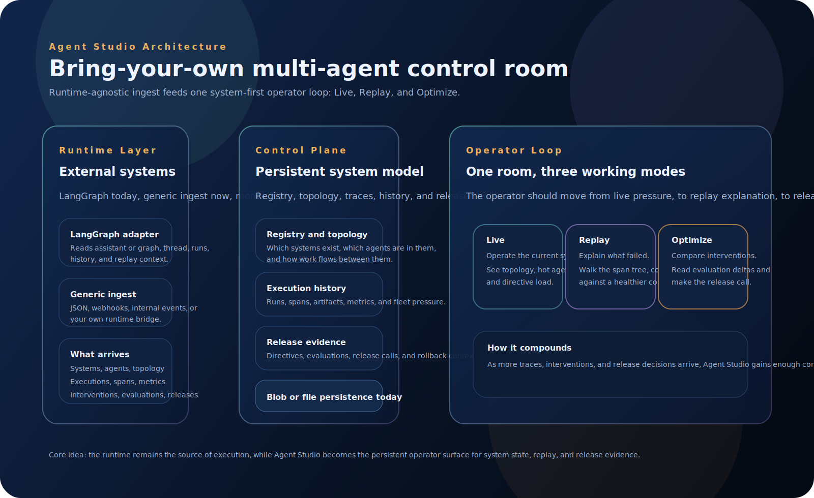

# Architecture Overview

This is the compact version of the product architecture.

## Core idea

The runtime stays the source of execution.

Agent Studio becomes the persistent operator surface for:

- system registry
- agent roster and topology
- execution history
- replay context
- evaluations and release decisions

## The flow

1. A runtime or adapter emits system and execution data.
2. Agent Studio maps that into the shared control-plane contract.
3. The control plane persists the registry, history, and release evidence.
4. The web app turns that into one operator loop:
   - `Live`
   - `Replay`
   - `Optimize`

## Why this shape matters

This product should not become another framework dashboard.

The architecture is designed so the same operator loop can work across:

- LangGraph
- generic internal runtimes
- future adapters

That is what keeps the product runtime-agnostic.

## Evolution

The architecture supports a deliberate progression:

1. Register the system
2. Add agents and topology
3. Ingest executions and spans
4. Add interventions, evaluations, and releases
5. Use accumulated history to support guarded recommendations later

That is the path to a system that becomes more useful the longer it runs.
